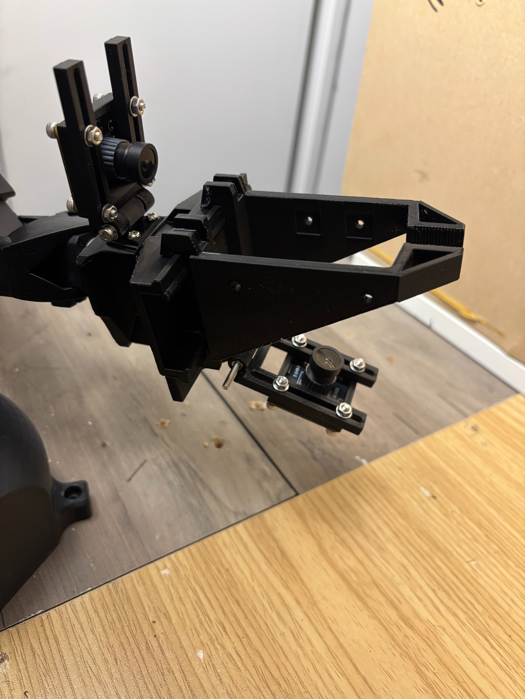
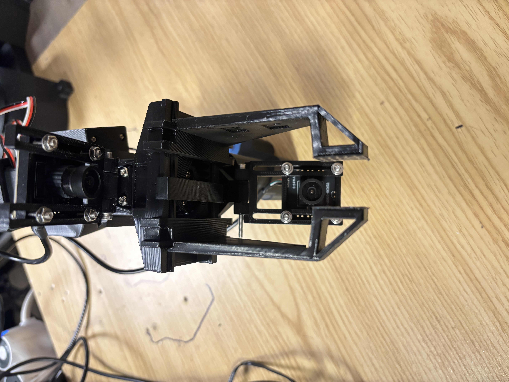
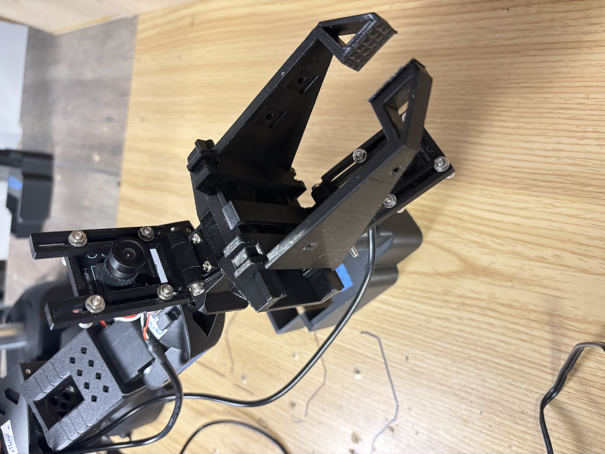

WORK-IN-PROGRESS

# SO-110

## Grippers

### 1. Parallel Gripper

The following gripper is a modified version of the base gripper that was designed by @norma-core (for full design and details: <https://github.com/norma-core/norma-core/blob/main/hardware/pgripper/README.md>).

This version includes several design modifications:

* Changed the shape, size, and length of the jaws to better handle small objects. The grasping point was also elevated closer to the camera for improved visibility.

* Added a mounting point on the gripper's base to support a bottom camera.

* Added notches on the inside of the jaws to support mouting arcs that can be used to grasp cylinderical tools (e.g. screw driver). See the "attachments" section.

  
  
  

The design .stl files can be found [here.](hardware/modified_gripper)

## Attachments

### 1. Height and tilt-adjustable wrist camera mount (top)

### 2. Height and tilt-adjustable wrist camera mount (bottom)

### 3. Arcs for screwdrivers

## Credits:

* I worked on the designs and modification in collaboration with @dotdotdotquestionmark.
* Parallel-jaws gripper original design: @norma-core
